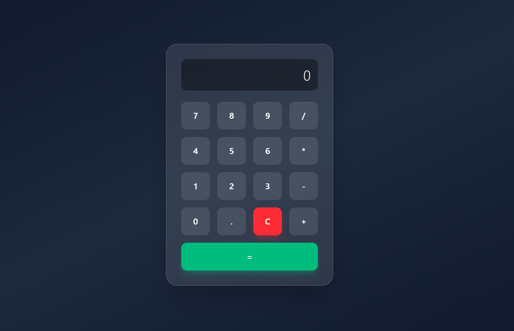

# 🧮 Minimal Calculator

A modern, minimalistic calculator built with **React** and **Tailwind CSS** — featuring a clean glassmorphism UI and smooth interactions.

🔗 **Live Demo:** [calculator-nine-azure-90.vercel.app](https://calculator-nine-azure-90.vercel.app/)

---



---

## ✨ Features

- ➕ Basic arithmetic operations (+ − × ÷)
- 🧹 Clear (C) functionality
- 🧠 Real-time expression building
- ⚠️ Error handling for invalid expressions
- 🎨 Glassmorphism UI with dark gradient background
- 📱 Fully responsive layout

## 🛠 Tech Stack

- **React** (Hooks — `useState`)
- **Tailwind CSS**
- **Vite**

## 🚀 Getting Started

```bash
git clone https://github.com/muzaffarbekmustafayev/Calculator.git
cd Calculator
npm install
npm run dev
```

## 📂 Project Structure

```
src/
 ├── components/
 │     └── Calculator.jsx
 ├── App.jsx
 └── main.jsx
```

## 🧩 Possible Improvements

- ⌨️ Keyboard support
- 📜 Calculation history panel
- 🧮 Scientific calculator mode
- 🔄 Custom expression parser (replace `eval`)
- 🟦 TypeScript migration
- 🌗 Dark / Light theme toggle
- 🧪 Unit tests
